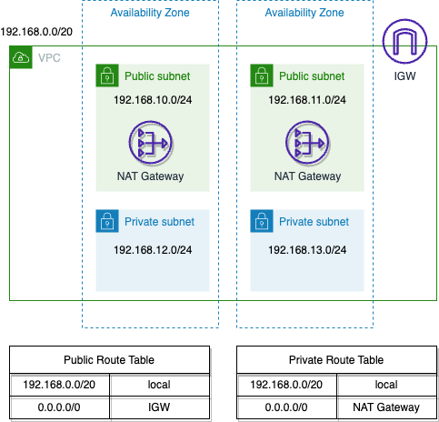

# IPv6 in AWS Sample Code

This repository is the sample code for the blog post series I am writing on enabling
IPV6 in AWS. You can find a copy of the post [here](https://colinbarker.me.uk/blog/2023-02-11-enabling-ipv6-on-aws-using-terraform/).

⚠️ If you are looking this far back in the commit history, you might be wondering
where all the code is! That's because I am writing on the fly! ⚠️

## [01-Sample-VPC](./01-sample-vpc)

Under the [01-sample-vpc](./01-sample-vpc) directory you will find a copy
of the base VPC and networking that we started with. This is a basic IPv4
based VPC using standard best practices.

## [02-VPC-With-IPv6](./02-vpc-with-ipv6)

This folder contains the final output from the blog first blog post, just to
check that your working is complete!